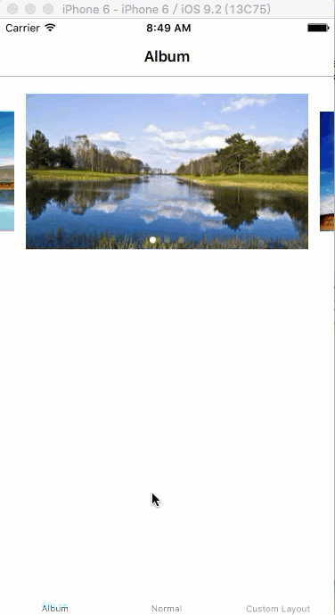
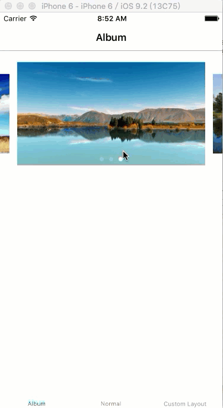
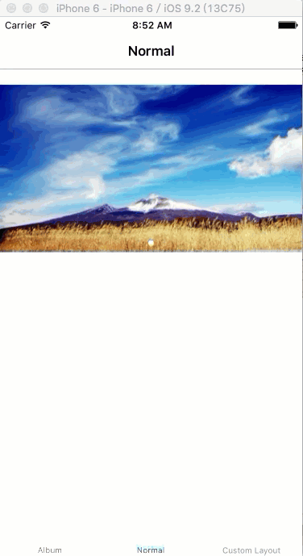
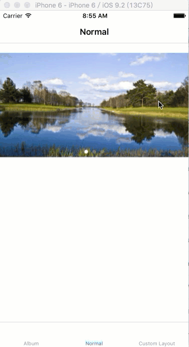
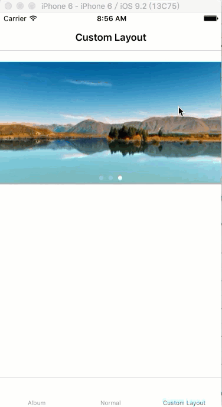

# BSCircleBanner

这是一个用于iOS设备的循环滚动视图。

## 安装

已上传至 [CocoaPods](http://cocoapods.org/?q=BSCircleBanner)

使用

```
pod 'BSCircleBanner'
```

或 

1. 将项目目录中的`BSCircleBanner`目录下的内容全部拷贝到需要使用的项目中；
2. 在项目中添加`Masonry`库。

## Preview

#### Album类型效果(自动滚动)



#### Album类型效果(手动滚动)



#### Normal类型效果(自动滚动)



#### Normal类型效果(手动滚动)



#### 使用自定义布局对象



## 快速使用


1. `#import "BSCircleBanner.h"`；
2. 创建`BSCircleBanner`的实例；
3. 设置该实例的属性，例如bannerSize等；
4. 将该实例作为子视图添加到某一视图中；
5. 设置data source和delegate对象并实现相应方法。

## 高级应用

现在，这个视图只提供了Album和Normal两种类型的显示效果，具体效果如上面的gif动画所示。修改`BSCircleBanner`实例的type属性可以修改该实例的显示效果。

你也可以自己定义一个layout对象，然后把他赋给`BSCircleBanner`实例的`customLayout`属性。